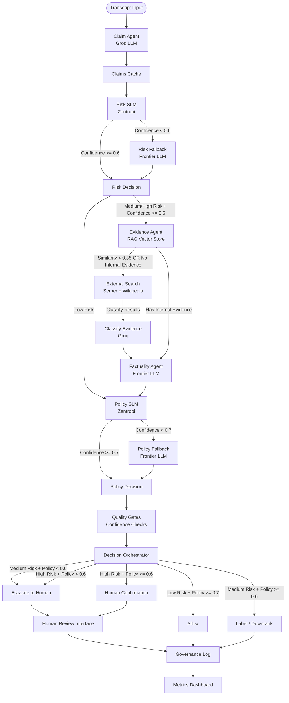

# LLM and Agent API Usage in Misinformation Claim Detection

This document explains how various LLM and agent-related APIs are used in misinformation claim detection systems, with a focus on **Groq** (LLM inference), **Zentropi** (SLM classification), and **Serper** (search API).

---

## Overview

Misinformation detection systems typically combine:
1. **LLM APIs** (e.g., Groq, OpenAI, Anthropic) - For reasoning, analysis, and text understanding
2. **Search APIs** (e.g., Serper, Google Search API) - For evidence retrieval from the web
3. **Knowledge Base APIs** (e.g., Wikipedia) - For structured, authoritative information

---

## 1. Groq API (LLM Inference)

### What is Groq?

Groq is a high-performance inference platform that provides fast LLM inference. It offers access to various open-source models like Llama, Mixtral, and others through a simple API.

### Role in Misinformation Detection

The LLM (via Groq) serves multiple critical functions:

1. **Claim Decomposition**: Breaking complex claims into atomic, verifiable statements
2. **Evidence Analysis**: Analyzing retrieved evidence to assess factuality
3. **Risk Assessment**: Understanding context and potential harm
4. **Policy Interpretation**: Translating factual assessments into policy decisions
5. **Summarization**: Condensing large amounts of evidence into actionable insights

### General Usage Pattern

```python
from langchain_groq import ChatGroq
from langchain_core.prompts import ChatPromptTemplate

# Initialize the LLM
llm = ChatGroq(
    api_key="your_groq_api_key",
    model="llama-3.3-70b-versatile"  # or other available models
)

# Example 1: Claim Decomposition
def decompose_claim(claim: str) -> list:
    """
    Break down a compound claim into atomic sub-claims.
    """
    prompt = f"""Break down the following claim into atomic factual assertions.
    Each sub-claim should be a single, verifiable statement.

    Claim: {claim}

    Provide a list of atomic claims, one per line.
    Format: "Claim A: [description]"
    """

    response = llm.invoke(prompt)
    # Parse response to extract sub-claims
    return parse_sub_claims(response.content)

# Example 2: Factuality Assessment
def assess_factuality(claim: str, evidence: str) -> dict:
    """
    Assess whether a claim is factually accurate based on evidence.
    """
    prompt = f"""Claim: {claim}

    Evidence: {evidence}

    Based on the evidence, assess the factual accuracy of the claim.
    Respond with ONE of: 'Likely True', 'Likely False', or 'Uncertain / Disputed'.
    Then provide a brief reasoning (2-3 sentences).
    """

    response = llm.invoke(prompt)
    return {
        "factuality": extract_factuality_label(response.content),
        "reasoning": response.content
    }

# Example 3: Evidence Summarization
def summarize_evidence(evidence_text: str) -> str:
    """
    Summarize retrieved evidence into concise insights.
    """
    prompt = f"""Summarize the following evidence into concise insights
    relevant to fact-checking a claim:

    {evidence_text}
    """

    response = llm.invoke(prompt)
    return response.content

# Example 4: Risk Assessment (Context Understanding)
def assess_risk(claim: str) -> dict:
    """
    Assess the potential harm and risk level of a claim.
    """
    prompt = f"""Analyze the following claim for potential harm indicators:

    Claim: {claim}

    Consider:
    - Topic sensitivity (health, elections, safety, etc.)
    - Presence of actionable instructions
    - Mentions of vulnerable populations
    - Calls to action

    Respond with risk tier: 'high', 'medium', or 'low'
    and provide rationale.
    """

    response = llm.invoke(prompt)
    return parse_risk_assessment(response.content)
```

### Key Advantages of Groq

- **Speed**: Very fast inference compared to many alternatives
- **Cost-Effective**: Competitive pricing for high-volume use
- **Open Models**: Access to open-source models like Llama
- **Scalability**: Handles high-throughput scenarios well

---

## 2. Zentropi API (SLM Classification)

### What is Zentropi?
Zentropi provides labeler-driven small language models (SLMs) that output compact labels and confidence scores for fast classification tasks.

### Role in Misinformation Detection
Zentropi is used for **fast, steerable classification**:
1. **Risk Tiering**: Coarse risk level classification (Low/Medium/High)
2. **Policy Interpretation**: Preliminary policy violation label
3. **Confidence Gates**: Route low-confidence cases to frontier LLMs

### General Usage Pattern
```python
import requests

url = "https://api.zentropi.ai/v1/label"
headers = {
    "Authorization": "Bearer YOUR_API_KEY",
    "Content-Type": "application/json"
}
data = {
    "content_text": "YOUR TEXT TO LABEL HERE",
    "labeler_id": "YOUR_LABELER_ID",
    "labeler_version_id": "YOUR_LABELER_VERSION_ID"
}
response = requests.post(url, headers=headers, json=data)
print(response.json())
```

### Key Advantages of Zentropi
- **Speed**: Low latency for high-volume classification
- **Control**: Labelers can be tailored to policy/risk taxonomy
- **Cost**: Lower cost per decision than full LLM prompts

---

## 3. Serper API (Google Search)

### What is Serper?

Serper is a Google Search API that provides programmatic access to Google search results. It returns structured search results including titles, snippets, URLs, and metadata.

### Role in Misinformation Detection

Serper is used for **evidence retrieval** - finding relevant information from the web to verify claims:

1. **Web Search**: Finding recent articles, news, and authoritative sources
2. **Source Discovery**: Identifying multiple sources to cross-reference
3. **Real-time Information**: Accessing up-to-date information not in static knowledge bases
4. **Source Diversity**: Gathering evidence from different domains and perspectives

### General Usage Pattern

```python
from langchain_community.utilities import GoogleSerperAPIWrapper
from langchain_core.tools import Tool

# Initialize Serper
serper = GoogleSerperAPIWrapper(api_key="your_serper_api_key")

# Example 1: Direct Search
def search_evidence(claim: str) -> dict:
    """
    Search for evidence related to a claim.
    """
    # Serper returns structured results
    results = serper.results(claim)

    evidence = {
        "organic_results": results.get("organic", []),
        "knowledge_graph": results.get("knowledgeGraph", {}),
        "answer_box": results.get("answerBox", {}),
        "total_results": results.get("searchInformation", {}).get("totalResults", 0)
    }

    return evidence

# Example 2: Using as a LangChain Tool
def create_search_tool():
    """
    Create a search tool for use in LangChain agents.
    """
    search_tool = Tool(
        name="Google Search",
        func=serper.run,
        description="Useful for searching general evidence and articles on the web. "
                   "Use this when you need to find recent information, news articles, "
                   "or authoritative sources to verify a claim."
    )
    return search_tool

# Example 3: Evidence Retrieval with Filtering
def retrieve_evidence_for_claim(claim: str, max_results: int = 10) -> list:
    """
    Retrieve and filter evidence for a specific claim.
    """
    # Search with claim
    results = serper.results(claim)

    evidence_items = []
    for item in results.get("organic", [])[:max_results]:
        evidence_items.append({
            "title": item.get("title", ""),
            "snippet": item.get("snippet", ""),
            "url": item.get("link", ""),
            "source": extract_domain(item.get("link", "")),
            "date": item.get("date", "Unknown")
        })

    return evidence_items

# Example 4: Multi-Query Search Strategy
def comprehensive_evidence_search(claim: str) -> dict:
    """
    Perform multiple searches with different query formulations.
    """
    # Original claim
    query1 = claim

    # Claim with "fact check" context
    query2 = f"fact check {claim}"

    # Claim with "debunk" context
    query3 = f"debunk {claim}"

    all_results = {
        "direct_search": serper.results(query1),
        "fact_check_search": serper.results(query2),
        "debunk_search": serper.results(query3)
    }

    return all_results
```

### Key Advantages of Serper

- **Real-time Results**: Access to current web information
- **Structured Data**: Returns JSON with organized fields
- **Cost-Effective**: More affordable than official Google Search API
- **Rich Metadata**: Includes snippets, dates, and source information

---

## 4. Wikipedia API (Knowledge Base)

### What is Wikipedia API?

Wikipedia provides programmatic access to its encyclopedia content through various APIs. LangChain includes a wrapper for easy Wikipedia searches.

### Role in Misinformation Detection

Wikipedia serves as a **structured knowledge source**:

1. **Authoritative Information**: Well-sourced, peer-reviewed content
2. **Structured Data**: Organized articles with clear sections
3. **Historical Context**: Background information on topics
4. **Cross-references**: Links to related topics and sources

### General Usage Pattern

```python
from langchain_community.utilities import WikipediaAPIWrapper

# Initialize Wikipedia wrapper
wikipedia = WikipediaAPIWrapper()

# Example 1: Basic Wikipedia Search
def search_wikipedia(topic: str) -> str:
    """
    Search Wikipedia for information about a topic.
    """
    result = wikipedia.run(topic)
    return result

# Example 2: Using as a LangChain Tool
def create_wikipedia_tool():
    """
    Create a Wikipedia tool for use in LangChain agents.
    """
    wiki_tool = Tool(
        name="Wikipedia Search",
        func=wikipedia.run,
        description="Useful for finding reliable and structured information "
                   "on Wikipedia. Use this for well-established facts, "
                   "historical events, scientific concepts, and general knowledge."
    )
    return wiki_tool
```

---

## 5. LangChain Agents (Orchestration)

### What are LangChain Agents?

LangChain Agents combine LLMs with tools (like search APIs) to create autonomous systems that can reason about tasks and use tools to accomplish them.

### Role in Misinformation Detection

Agents orchestrate the entire fact-checking workflow:

1. **Tool Selection**: Deciding which tools to use (search, Wikipedia, etc.)
2. **Query Formulation**: Creating effective search queries
3. **Evidence Synthesis**: Combining results from multiple sources
4. **Iterative Refinement**: Following up with additional searches if needed

### General Usage Pattern

```python
from langchain.agents import initialize_agent, AgentType
from langchain_core.tools import Tool

# Example: Creating an Evidence Retrieval Agent
def create_evidence_retrieval_agent(llm, search_tool, wiki_tool):
    """
    Create an agent that can retrieve evidence using multiple tools.
    """
    tools = [search_tool, wiki_tool]

    agent = initialize_agent(
        tools=tools,
        llm=llm,
        agent=AgentType.ZERO_SHOT_REACT_DESCRIPTION,
        verbose=True
    )

    return agent

# Example: Using the Agent
def retrieve_evidence_with_agent(claim: str, agent):
    """
    Use an agent to intelligently retrieve evidence for a claim.
    """
    prompt = f"""Find evidence to verify or refute the following claim:

    Claim: {claim}

    Use the available tools to search for relevant information.
    Try multiple search strategies if needed.
    """

    result = agent.run(prompt)
    return result
```

---

## 6. Complete Workflow Example

Here's how these APIs work together in a misinformation detection system:

```python
from langchain_groq import ChatGroq
from langchain_community.utilities import GoogleSerperAPIWrapper, WikipediaAPIWrapper
from langchain.agents import initialize_agent, AgentType
from langchain_core.tools import Tool

# Initialize APIs
llm = ChatGroq(api_key="groq_key", model="llama-3.3-70b-versatile")
serper = GoogleSerperAPIWrapper(api_key="serper_key")
wikipedia = WikipediaAPIWrapper()

# Create tools
search_tool = Tool(
    name="Google Search",
    func=serper.run,
    description="Search the web for recent information and news"
)

wiki_tool = Tool(
    name="Wikipedia",
    func=wikipedia.run,
    description="Search Wikipedia for authoritative information"
)

# Create agent
evidence_agent = initialize_agent(
    tools=[search_tool, wiki_tool],
    llm=llm,
    agent=AgentType.ZERO_SHOT_REACT_DESCRIPTION
)

def fact_check_claim(claim: str) -> dict:
    """
    Complete fact-checking workflow.
    """
    # Step 1: Decompose claim (using LLM)
    sub_claims = decompose_claim(claim, llm)

    # Step 2: Assess risk (using LLM)
    risk_assessment = assess_risk(claim, llm)

    # Step 3: Retrieve evidence (using Agent with Serper/Wikipedia)
    if risk_assessment["risk_tier"] != "low":
        evidence = evidence_agent.run(f"Find evidence for: {claim}")
    else:
        evidence = "Low risk - minimal evidence retrieval"

    # Step 4: Summarize evidence (using LLM)
    if evidence and evidence != "Low risk - minimal evidence retrieval":
        summary = summarize_evidence(evidence, llm)
    else:
        summary = "No summary available"

    # Step 5: Assess factuality (using LLM)
    factuality = assess_factuality(claim, summary or evidence, llm)

    # Step 6: Policy interpretation (using LLM)
    policy_decision = interpret_policy(claim, factuality, risk_assessment, llm)

    return {
        "claim": claim,
        "sub_claims": sub_claims,
        "risk_assessment": risk_assessment,
        "evidence": evidence,
        "summary": summary,
        "factuality": factuality,
        "policy_decision": policy_decision
    }
```

---

## Key Design Patterns

### 1. Conditional Evidence Retrieval

Only retrieve evidence for high/medium risk claims to save costs:

```python
def conditional_evidence_retrieval(claim: str, risk_tier: str, agent):
    """
    Only retrieve evidence if risk is above threshold.
    """
    if risk_tier == "low":
        return {
            "evidence": "Low risk - minimal evidence retrieval",
            "retrieval_performed": False
        }

    # High/medium risk: full evidence retrieval
    evidence = agent.run(f"Find evidence for: {claim}")
    return {
        "evidence": evidence,
        "retrieval_performed": True
    }
```

### 2. Multi-Source Verification

Combine multiple sources for better accuracy:

```python
def multi_source_verification(claim: str, serper, wikipedia, llm):
    """
    Verify claim using multiple sources.
    """
    # Web search
    web_evidence = serper.run(claim)

    # Wikipedia search
    wiki_evidence = wikipedia.run(claim)

    # Combine and analyze
    combined_evidence = f"Web Results:\n{web_evidence}\n\nWikipedia:\n{wiki_evidence}"

    factuality = assess_factuality(claim, combined_evidence, llm)
    return factuality
```

### 3. Iterative Refinement

Allow agents to refine searches based on initial results:

```python
def iterative_evidence_gathering(claim: str, agent, max_iterations: int = 3):
    """
    Iteratively gather evidence, refining searches as needed.
    """
    all_evidence = []

    for i in range(max_iterations):
        if i == 0:
            query = claim
        else:
            # Refine query based on previous results
            query = f"{claim} fact check verification"

        result = agent.run(f"Search for: {query}")
        all_evidence.append(result)

        # Check if we have sufficient evidence
        if is_sufficient_evidence(all_evidence):
            break

    return "\n\n".join(all_evidence)
```

---

## Cost and Performance Considerations

### Groq API
- **Cost**: Pay-per-token, typically very affordable
- **Speed**: Very fast inference (key advantage)
- **Best for**: High-volume, real-time applications

### Serper API
- **Cost**: Pay-per-search query
- **Rate Limits**: Check your plan's limits
- **Best for**: Real-time web evidence retrieval

### Optimization Strategies
1. **Risk-based retrieval**: Only search for high-risk claims
2. **Caching**: Cache common searches and fact-checks
3. **Batch processing**: Process multiple claims together when possible
4. **Query optimization**: Use specific, targeted search queries

---

## Security and Privacy Considerations

1. **API Keys**: Store securely in environment variables, never commit to git
2. **User Data**: Be careful about logging or storing user claims
3. **Rate Limiting**: Implement rate limiting to prevent abuse
4. **Input Validation**: Sanitize user inputs before sending to APIs
5. **Error Handling**: Handle API failures gracefully

---

## Conclusion

---

## 7. Decision Flow and Routing Logic

### Overview

The system uses a multi-stage pipeline with confidence-gated routing, SLM-first optimization, and deterministic orchestration. Each stage has specific thresholds that control routing decisions and ensure quality.

### Complete Decision Flow



### Agent Execution Routes

#### 1. Claim Agent (Always Executed)
- **Provider**: Groq (high-throughput LLM)
- **Model**: `llama-3.3-70b-versatile`
- **Purpose**: Extract factual claims from transcript
- **Output**: List of claims with domain tags and confidence scores
- **Threshold**: `claim_confidence_threshold = 0.65`
  - **Why**: Claims below 0.65 confidence are ambiguous and may need human review for high-impact content

#### 2. Risk Agent (Always Executed)
- **Primary Route**: Zentropi SLM (fast classification)
- **Fallback Route**: Frontier LLM (Azure OpenAI/Foundry) if SLM confidence < 0.6
- **Purpose**: Assess potential harm and risk tier (Low/Medium/High)
- **Output**: Risk tier, confidence, reasoning, vulnerable populations
- **Threshold**: `risk_confidence_threshold = 0.6`
  - **Why**: 0.6 balances speed (SLM) vs accuracy (frontier). Below 0.6, the claim is ambiguous enough to warrant frontier LLM analysis

#### 3. Evidence Agent (Conditional Execution)
- **Trigger**: Medium/High risk AND risk confidence >= 0.6
- **Provider**: ChromaDB vector store (RAG)
- **Purpose**: Retrieve supporting/contradicting evidence from internal knowledge base
- **Output**: Evidence items with relevance scores
- **Threshold**: `evidence_similarity_cutoff = 0.4`
  - **Why**: Filters out low-signal evidence (relevance < 0.4) to reduce noise and improve factuality assessment quality

#### 4. External Search (Conditional Execution)
- **Trigger**: Medium/High risk AND (similarity < 0.35 OR no internal evidence)
- **Providers**: Serper (Google Search) + Wikipedia API
- **Purpose**: Find external evidence when internal KB is insufficient
- **Classification**: Each result classified by Groq as supporting/contradicting/contextual
- **Threshold**: `novelty_similarity_threshold = 0.35`
  - **Why**: Similarity < 0.35 indicates high novelty (claim not well-covered in internal KB). External search fills gaps for novel claims that need verification

#### 5. Factuality Agent (Conditional Execution)
- **Trigger**: Medium/High risk AND risk confidence >= 0.6
- **Provider**: Frontier LLM (Azure OpenAI/Foundry)
- **Purpose**: Assess truthfulness of claims against evidence
- **Output**: Factuality assessments (Likely True/False/Uncertain) with confidence
- **Note**: Uses both internal and external classified evidence

#### 6. Policy Agent (Always Executed)
- **Primary Route**: Zentropi SLM (fast policy interpretation)
- **Fallback Route**: Frontier LLM if SLM confidence < 0.7
- **Purpose**: Interpret policy and determine violations
- **Output**: Violation status, policy confidence, allowed contexts
- **Threshold**: `policy_confidence_threshold = 0.7`
  - **Why**: Policy decisions require higher confidence (0.7) than risk (0.6) because they directly affect content moderation actions

### Decision Matrix

The final decision is made based on risk tier and policy confidence:

| Risk Tier | Policy Confidence | Decision Action | Rationale |
|-----------|------------------|-----------------|-----------|
| **Low** | ≥ 0.7 | **Allow** | Low risk + high confidence = safe to allow |
| **Low** | < 0.7 | **Label / Downrank** | Low risk but uncertain = apply warning label |
| **Medium** | ≥ 0.6 | **Label / Downrank** | Medium risk + moderate confidence = label for transparency |
| **Medium** | < 0.6 | **Escalate to Human** | Medium risk + low confidence = needs human judgment |
| **High** | < 0.6 | **Escalate to Human** | High risk + low confidence = critical, needs review |
| **High** | ≥ 0.6 | **Human Confirmation** | High risk + high confidence = still needs human sign-off before action |

### Human Review Triggers

Human review is required when:

1. **Decision Action Requires It**: `ESCALATE_HUMAN` or `HUMAN_CONFIRMATION`
2. **Conflicting Evidence**: Medium/High risk content with contradicting evidence
3. **Low Confidence Gates** (for Medium/High risk only):
   - Claim confidence < 0.65
   - Risk confidence < 0.6
   - Policy confidence < 0.7 (for High risk)
4. **Cross-Policy Conflicts**: Policy interpretation detects conflicts (e.g., violation but allowed contexts exist)

### Threshold Summary and Rationale

| Threshold | Value | Purpose | Why This Value |
|-----------|-------|---------|----------------|
| `claim_confidence_threshold` | 0.65 | Gate for claim extraction quality | 0.65 filters ambiguous claims while allowing clear ones. Too high (0.8+) would reject valid but nuanced claims. |
| `risk_confidence_threshold` | 0.6 | SLM fallback trigger for risk | 0.6 balances speed vs accuracy. Below 0.6, risk assessment is uncertain enough to warrant frontier LLM. |
| `policy_confidence_threshold` | 0.7 | SLM fallback trigger for policy | 0.7 is higher than risk because policy decisions directly affect moderation. Requires more certainty. |
| `novelty_similarity_threshold` | 0.35 | External search trigger | 0.35 means similarity < 35% = high novelty. Low enough to catch novel claims, high enough to avoid unnecessary searches. |
| `evidence_similarity_cutoff` | 0.4 | RAG relevance filter | 0.4 filters out low-signal evidence (relevance < 40%). Prevents noise from marginally relevant results. |

### Performance Optimizations

1. **SLM-First Routing**: Zentropi SLM runs first (fast, cheap). Falls back to frontier LLM only if confidence is low.
2. **Conditional RAG**: Evidence retrieval only for Medium/High risk content with confident risk assessment.
3. **External Search Gating**: Only triggers for high-novelty claims (similarity < 0.35) or when internal evidence is missing.
4. **Groq for High-Throughput**: Claim extraction and evidence classification use Groq (fast inference).
5. **Frontier LLM for Complex Tasks**: Factuality and fallback routes use frontier LLMs (higher accuracy).

### Cost and Latency Controls

- **SLM Timeout**: 2.5s per call (Zentropi)
- **Frontier Timeout**: 6.0s per call (Azure OpenAI/Foundry)
- **Token Budgets**:
  - SLM: 800 tokens max
  - Frontier: 2000 tokens max
  - Claim extraction: 900 tokens max

---

In misinformation detection systems:

Together, these APIs create a comprehensive system that can:
1. Understand claims and their context
2. Retrieve relevant evidence
3. Analyze factuality
4. Make policy-aware decisions
5. Provide explainable results

The key is combining multiple sources of information (web search + knowledge bases) with intelligent reasoning (LLMs) to make informed decisions about potentially misleading content.
